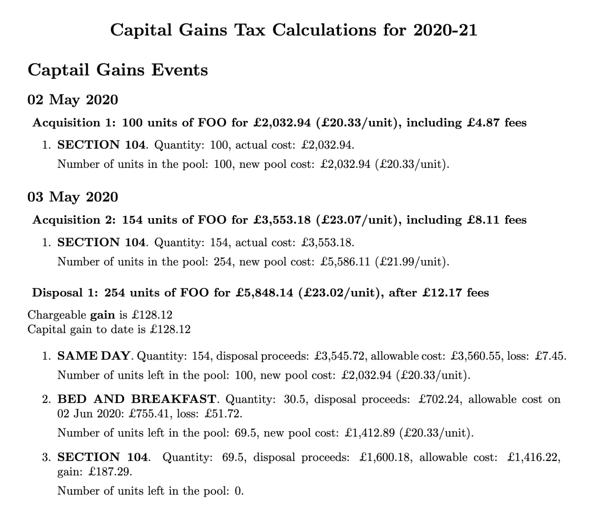

[](https://github.com/KapJI/capital-gains-calculator/actions)
[](https://pypi.org/project/cgt-calc/)

# 💷 UK Capital Gains Calculator

Easily calculate **UK Capital Gains Tax** from your investment transaction history.

Supported sources include **Charles Schwab**, **Trading 212**, **Morgan Stanley**, **Sharesight**, **Vanguard**, or a custom **RAW** format.

The tool generates a detailed **PDF report** with all calculations.

All prices are automatically converted to **GBP**, and all **HMRC rules** are applied — including the **same-day**, **bed and breakfast**, and **Section 104 holding** rules.

The PDF report includes separate **Capital Gains** and **Interest and Dividens** sections, with a summary at the end.
Interest is grouped **monthly per broker** to keep reports concise, even for brokers that pay daily interest.

## 📑 Table of Contents

-   [Example Report](#-example-report)
-   [Prerequisites](#-prerequisites)
-   [Installation](#%EF%B8%8F-installation)
    -   [Installing LaTeX](#installing-latex)
-   [Usage](#-usage)
-   [Input Data](#-input-data)
    -   [Broker Instructions](#broker-instructions)
    -   [Offshore Funds](#offshore-funds)
    -   [Additional Files and Options](#additional-files-and-options)
-   [Using Docker](#-using-docker)
-   [Disclaimer](#%EF%B8%8F-disclaimer)
-   [Contributing](#-contributing)

## 📊 Example Report

Here's what a generated PDF report looks like:

<a href="./calculations_example.pdf">
  
</a>

👉 [View full example report (PDF)](https://github.com/KapJI/capital-gains-calculator/blob/main/calculations_example.pdf)

## 🔧 Prerequisites

-   **Python 3.12** or newer
-   **pdflatex** must be available in your `PATH` (required for generating PDF reports)

## ⚙️ Installation

You can install the calculator using [uv](https://docs.astral.sh/uv/concepts/tools/#the-uv-tool-interface), [pipx](https://pypa.github.io/pipx/), or standard `pip`:

```shell
uv tool install cgt-calc
```

Or run it directly without installing:

```shell
uvx cgt-calc
```

### Installing LaTeX

#### MacOS

```shell
brew install --cask mactex-no-gui
```

#### Debian/Ubuntu

```shell
apt install texlive-latex-base
```

#### Windows

[Install MiKTeX.](https://miktex.org/download)

## 🚀 Usage

-   You need to provide the **transaction history** for each of your accounts. See the [Broker Instructions](#broker-instructions).
-   The history should include **all transactions** since you first acquired any shares owned during the relevant tax years.
-   If you own or have owned **funds from outside the UK** (i.e. Ireland), either them being accumulating or distributing, see the [Offshore Funds](#offshore-funds).
-   Once you've gathered all transactions from all your brokers, generate a report — for example, for tax year 2020/21:

```shell
cgt-calc --year 2020 --schwab schwab_transactions.csv --trading212 trading212/ --mssb mmsb_report/
```

-   Run `cgt-calc --help` for all available options.
-   If your broker is not listed, try using the **RAW** format.
    Contributions for new brokers are very welcome!

## 📥 Input data

### Broker Instructions

<details>
    <summary>🏦 Instructions for Charles Schwab</summary>

You will need:

-   **Exported transaction history in CSV format.**
    Schwab only allows to download transaction for the last 4 years. If you require more, you can download the history in 4-year chunks and combine them.
    [See example](https://github.com/KapJI/capital-gains-calculator/blob/main/tests/test_data/schwab_transactions.csv).
-   **Exported transaction history from Schwab Equity Awards in CSV format.**
    Only applicable if you receive equity awards in your account (e.g. for Alphabet/Google employees). Follow the same procedure as in the normal transaction history but selecting your Equity Award account.

Example usage for the tax year 2020/21:

```shell
cgt-calc --year 2020 --schwab schwab_transactions.csv --schwab-award schwab_awards.csv
```

_Note: For historic reasons, it is possible to provide the Equity Awards history in JSON format with `--schwab_equity_award_json`. Instructions are available at the top of this [parser file](../main/cgt_calc/parsers/schwab_equity_award_json.py). Please use the CSV method above if possible._

</details>
 <br />
<details>
    <summary>🏦 Instructions for Trading212</summary>

You will need:

-   **Exported transaction history from Trading 212.**
    You can provide a folder containing several files since Trading 212 limit the statements to 1 year periods.
    [See example](https://github.com/KapJI/capital-gains-calculator/tree/main/tests/test_data/trading212).

Example usage for the tax year 2024/25:

```shell
cgt-calc --year 2024 --trading212 trading212_trxs_dir/
```

</details>
 <br />
<details>
    <summary>🏦 Instructions for Morgan Stanley</summary>

You will need:

-   **Exported transaction history from Morgan Stanley.**
    Since Morgan Stanley generates multiple files in a single report, please specify a directory produced from the report download page.
    [See example](https://github.com/KapJI/capital-gains-calculator/tree/main/tests/test_data/mssb).

Example usage for the tax year 2024/25:

```shell
cgt-calc --year 2024 --mssb morgan_stanley_trxs_dir/
```

</details>
 <br />
<details>
    <summary>🏦 Instructions for Sharesight</summary>

You will need:

-   **Exported transaction history from Sharesight.**
    Sharesight is a portfolio tracking tool with support for multiple brokers.
    -   You will need the "All Trades" and "Taxable Income" reports since the beginning. Make sure to select "Since Inception" for the period, and "Not Grouping".
    -   Export both reports to Excel or Google Sheets, save as CSV, and place them in the same folder.
    -   [See example](https://github.com/KapJI/capital-gains-calculator/tree/main/tests/test_data/sharesight).

Comments:

-   Sharesight aggregates transactions from multiple brokers, but doesn't necessarily have balance information.
    Use the `--no-balance-check` flag to avoid spurious errors.

-   Since there is no direct support for equity grants, add `Stock Activity` as part of the comment associated with any vesting transactions - making sure they have the grant price filled ([see example](https://github.com/KapJI/capital-gains-calculator/tree/main/tests/test_data/sharesight)).

Example usage for the tax year 2024/25:

```shell
cgt-calc --year 2024 --no-balance-check --sharesight sharesight_trxs_dir/
```

</details>
 <br />
<details>
    <summary>🏦 Instructions for Vanguard</summary>

You will need:

-   **Exported transaction history from Vanguard.**
    Vanguard can generate a report in Excel format with all transactions across all periods of time and all accounts (ISA, GA, etc). Grab the ones you're interested into (normally GA account) and put them in a single CSV file.
    [See example](https://github.com/KapJI/capital-gains-calculator/blob/main/tests/test_data/vanguard/report.csv).

Example usage for the tax year 2024/25:

```shell
cgt-calc --year 2024 --vanguard vanguard.csv
```

</details>
 <br />
<details>
    <summary>🏦 Instructions for RAW format</summary>

You will need:

-   **CSV using the RAW format.** If your broker isn't natively supported you might choose to convert whatever report you can produce into this basic format.
    [See example](https://github.com/KapJI/capital-gains-calculator/blob/main/tests/test_data/raw/test_data.csv)

Example usage for the tax year 2024/25:

```shell
cgt-calc --year 2024 --raw sharesight_trxs_dir/
```

</details>

### Offshore Funds

For correct taxation on [offshore funds](https://www.gov.uk/government/publications/offshore-funds-self-assessment-helpsheet-hs265/hs265-offshore-funds) you need to specify the yearly excess reported income (ERI) from each fund you have owned.
You can find the full list of funds that requires this at [HMRC](https://www.gov.uk/government/publications/offshore-funds-list-of-reporting-funds).

The tool already includes such yearly history in the [resources folder](https://github.com/KapJI/capital-gains-calculator/blob/main/cgt_calc/resources/eri). You can check if your fund is already included, or provide a custom ERI history file following the instructions [here](https://github.com/KapJI/capital-gains-calculator/blob/main/excess_reported_income_sources.md). We strongly suggest sharing compiled ERI data so it can be added to the package as it can save significant time to other users that hold the same fund.

Currently bundled data:

-   [Vanguard Funds Plc 2018-2024](https://github.com/KapJI/capital-gains-calculator/blob/main/cgt_calc/resources/eri/vanguard_eri.csv)

The ERI funds are indexed by ISIN and the tool provides automatic translation from ISIN to tickers, in case your broker doesn't supply the ISIN in their transaction history. For instructions on how to override ISIN translation look at the Extra options section below.

There are a few **unsupported** functionalities at the moment for taxation on offshore funds:

-   Tax calculations for offshore funds that are **not reporting to HMRC** as they don't report taxes as CGT but as income tax.
-   Excess Reported Income [equalisation](https://www.gov.uk/hmrc-internal-manuals/investment-funds/ifm13224) support which is an optional arrangement which certain funds can support to reduce the amount of excess reported income in case you held the fund stocks for less than the reporting period.

Check [ERI data additional instrunctions](excess_reported_income_sources.md) for more information.

### Additional Files and Options

-   **CSV file with initial stock prices in USD.** This is needed under special circumstances for example at the moment of vesting, split, etc.
    [`initial_prices.csv`](https://github.com/KapJI/capital-gains-calculator/blob/main/cgt_calc/resources/initial_prices.csv) comes pre-packaged, you need to use the same format. The program will inform when some required price is missing.
-   **(Automatic) Monthly exchange rates prices from [gov.uk](https://www.gov.uk/government/collections/exchange-rates-for-customs-and-vat).** This is needed to convert foreign currencies into GBP amounts. `exchange_rates.csv` gets generated automatically using HMRC API, you need to use the same format if you want to override it.
-   **Spin-off file.** Supplies extra information needed for spin-offs transactions through `--spin-offs-file`.
-   **Interest fund tickers.** To calculate dividends on bond funds/ETF properly you need to pass the comma separated list of funds ticker that are taxed as interest instead of dividends, using `--interest-fund-tickers` CLI option.
-   **(Automatic) ISIN to ticker translation from [Open FIGI](https://www.openfigi.com/api/overview).** This is needed to convert funds ISIN to tickers under special circumstances, such as calculating the Excess Reportable Income when your broker doesn't provide the ISIN column. [`initial_isin_translation.csv`](https://github.com/KapJI/capital-gains-calculator/blob/main/cgt_calc/resources/initial_isin_translation.csv) comes pre-packaged, you need to use the same format. `isin_translation.csv` gets generated automatically using Open FIGI API and you can use it to do manual overrides.

## 🐳 Using Docker

These steps will build and run the calculator in a self-contained environment, in case you would rather not have a systemwide LaTeX installation (or don't want to interfere with an existing one).
The following steps are tested on an Apple silicon Mac and may need to be slightly modified on other platforms.
With the cloned repository as the current working directory:

```shell
$ docker buildx build --platform linux/amd64 --tag capital-gains-calculator .
```

Now you've built and tagged the calculator image, you can drop into a shell with `cgt-calc` installed on `$PATH`. Navigate to where you store your transaction data, and run:

```shell
$ cd ~/Taxes/Transactions
$ docker run --rm -it -v "$PWD":/data capital-gains-calculator:latest
a4800eca1914:/data# cgt-calc [...]
```

This will create a temporary Docker container with the current directory on the host (where your transaction data is) mounted inside the container at `/data`. Follow the usage instructions below as normal,
and when you're done, simply exit the shell. You will be dropped back into the shell on your host, with your output report pdf etc..

## ⚠️ Disclaimer

Please note: I’m **not a tax adviser**. Use this tool and its outputs **at your own risk**.

## 🤝 Contributing

Contributions are welcome!
If you find a bug, have feature ideas, or want to add support for more brokers, please open an **issue** or **pull request**.

See [CONTRIBUTING.md](CONTRIBUTING.md) for setup instructions and development guidelines.
