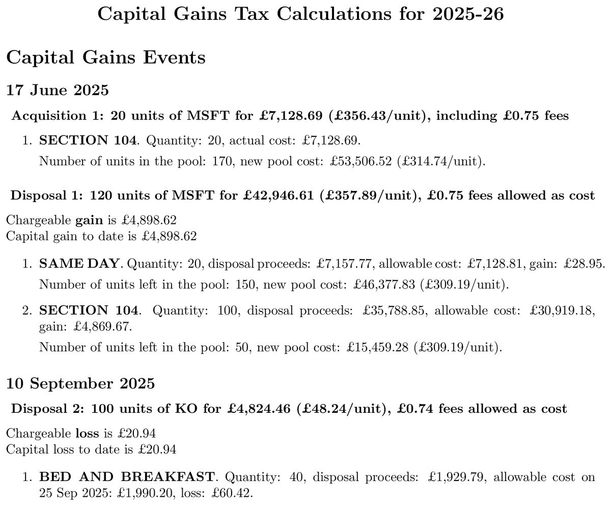

[](https://pypi.org/project/cgt-calc/)
[](https://github.com/KapJI/capital-gains-calculator/actions)
[](https://app.codecov.io/gh/KapJI/capital-gains-calculator)

#  UK Capital Gains Calculator

Easily calculate **UK Capital Gains Tax** from your investment transaction history.

Supported sources include **Charles Schwab**, **Trading 212**, **Morgan Stanley**, **Sharesight**,
**Hargreaves Lansdown**, **Vanguard**, **Freetrade**, **Interactive Brokers**, or a custom **RAW**
format.

The tool generates a detailed **PDF report** with all calculations.

All prices are automatically converted to **GBP**, and all **HMRC rules** are applied — including
the **same-day**, **bed and breakfast**, and **Section 104 holding** rules.

## 📊 Example Report

<a href="docs/assets/example_report.pdf">
  
</a>

## 🚀 Quick Start

Install with [uv](https://docs.astral.sh/uv/concepts/tools/#the-uv-tool-interface) (or pipx/pip) and
generate a report for a tax year:

```shell
uv tool install cgt-calc
cgt-calc --year 2024 --schwab-file schwab_transactions.csv
```

`pdflatex` must be on your `PATH` to generate the PDF report. See
[Installation](https://cgt-calc.uk/installation/) and [Usage](https://cgt-calc.uk/usage/) for
details, and [Brokers](https://cgt-calc.uk/brokers/) for how to export your transaction history.

## 📚 Documentation

Full documentation — installation, per-broker export guides, offshore funds (ERI), configuration,
and Docker usage — lives at **[cgt-calc.uk](https://cgt-calc.uk/)**.

## 🤝 Contributing

Contributions are welcome! If you find a bug, have feature ideas, or want to add support for more
brokers, please open an **issue** or **pull request**. See the
[development guide](https://cgt-calc.uk/development/).

## ⚠️ Disclaimer

Please note: I'm **not a tax adviser**. Use this tool and its outputs **at your own risk**.
