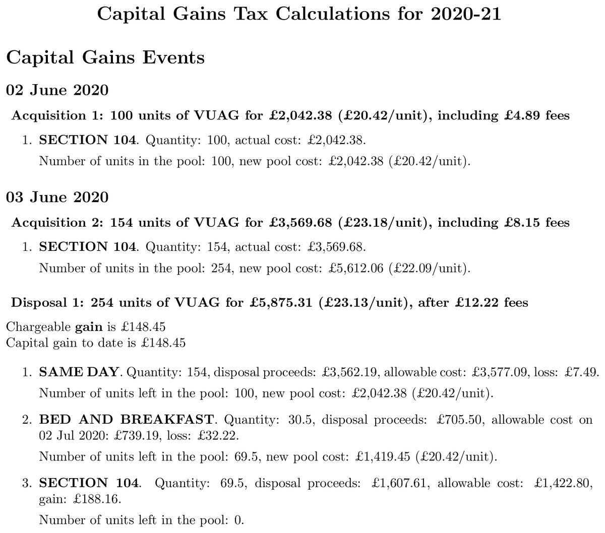

[](https://github.com/KapJI/capital-gains-calculator/actions)
[](https://pypi.org/project/cgt-calc/)

# 💷 UK Capital Gains Calculator

Easily calculate **UK Capital Gains Tax** from your investment transaction history.

Supported sources include **Charles Schwab**, **Trading 212**, **Morgan Stanley**, **Sharesight**,
**Vanguard**, **Freetrade**, or a custom **RAW** format.

The tool generates a detailed **PDF report** with all calculations.

All prices are automatically converted to **GBP**, and all **HMRC rules** are applied — including
the **same-day**, **bed and breakfast**, and **Section 104 holding** rules.

The PDF report includes separate **Capital Gains** and **Interest and Dividens** sections, with a
summary at the end. Interest is grouped **monthly per broker** to keep reports concise, even for
brokers that pay daily interest.

## 📑 Table of Contents

- [Example Report](#-example-report)
- [Prerequisites](#-prerequisites)
- [Installation](#%EF%B8%8F-installation)
  - [Installing LaTeX](#installing-latex)
- [Usage](#-usage)
- [Input Data](#-input-data)
  - [Broker Instructions](#broker-instructions)
  - [Offshore Funds](#offshore-funds)
  - [Configuration Files and Data Sources](#configuration-files-and-data-sources)
- [Using Docker](#-using-docker)
- [Privacy & Data Security](#-privacy--data-security)
- [Disclaimer](#%EF%B8%8F-disclaimer)
- [Contributing](#-contributing)

## 📊 Example Report

Here's what a generated PDF report looks like:

<a href="./docs/example_report.pdf">
  
</a>

👉 [View full example report (PDF)](docs/example_report.pdf)

## 🔧 Prerequisites

- **Python 3.12** or newer
- **pdflatex** must be available in your `PATH` (required for generating PDF reports)

## ⚙️ Installation

You can install the calculator using
[uv](https://docs.astral.sh/uv/concepts/tools/#the-uv-tool-interface),
[pipx](https://pipx.pypa.io/), or standard `pip`:

```shell
uv tool install cgt-calc
```

Or run it directly without installing:

```shell
uvx cgt-calc
```

### Installing LaTeX

#### MacOS

```shell
brew install --cask mactex-no-gui
```

#### Debian/Ubuntu

```shell
apt install texlive-latex-base
```

#### Windows

[Install MiKTeX.](https://miktex.org/download)

## 🚀 Usage

- You need to provide the **transaction history** for each of your accounts. See the
  [Broker Instructions](#broker-instructions).
- The history should include **all transactions** since you first acquired any shares owned during
  the relevant tax years.
- If you own or have owned **funds from outside the UK** (i.e. Ireland), either them being
  accumulating or distributing, see the [Offshore Funds](#offshore-funds).
- Once you've gathered all transactions from all your brokers, generate a report — for example, for
  tax year 2020/21:

```shell
cgt-calc --year 2020 --schwab-file schwab_transactions.csv --trading212-dir trading212/ --mssb-dir mmsb_report/
```

- Run `cgt-calc --help` for all available options.
- If your broker is not listed, try using the **RAW** format. Contributions for new brokers are very
  welcome!

## 📥 Input data

### Broker Instructions

<details>
    <summary>🏦 Instructions for Charles Schwab</summary>

You will need:

- **Exported transaction history in CSV format.** Schwab only allows to download transaction for the
  last 4 years. If you require more, you can download the history in 4-year chunks and combine them.
  [See example](tests/schwab/data/schwab_transactions.csv).
- **Exported transaction history from Schwab Equity Awards in CSV format.** Only applicable if you
  receive equity awards in your account (e.g. for Alphabet/Google employees). Follow the same
  procedure as in the normal transaction history but selecting your Equity Award account.

Example usage for the tax year 2020/21:

```shell
cgt-calc --year 2020 --schwab-file schwab_transactions.csv --schwab-award-file schwab_awards.csv
```

_Note: For historic reasons, it is possible to provide the Equity Awards history in JSON format with
`--schwab-equity-award-json`. Instructions are available at the top of this
[parser file](cgt_calc/parsers/schwab_equity_award_json.py). Please use the CSV method above if
possible._

</details>
 <br />
<details>
    <summary>🏦 Instructions for Trading212</summary>

You will need:

- **Exported transaction history from Trading 212.** You can provide a folder containing several
  files since Trading 212 limit the statements to 1 year periods.
  [See example](tests/trading212/data/2024/inputs/).

Example usage for the tax year 2024/25:

```shell
cgt-calc --year 2024 --trading212-dir trading212_trxs_dir/
```

</details>
 <br />
<details>
    <summary>🏦 Instructions for Morgan Stanley</summary>

You will need:

- **Exported transaction history from Morgan Stanley.** Since Morgan Stanley generates multiple
  files in a single report, please specify a directory produced from the report download page.
  [See example](tests/morgan_stanley/data/).

Example usage for the tax year 2024/25:

```shell
cgt-calc --year 2024 --mssb-dir morgan_stanley_trxs_dir/
```

</details>
 <br />
<details>
    <summary>🏦 Instructions for Sharesight</summary>

You will need:

- **Exported transaction history from Sharesight.** Sharesight is a portfolio tracking tool with
  support for multiple brokers.
  - You will need the "All Trades" and "Taxable Income" reports since the beginning. Make sure to
    select "Since Inception" for the period, and "Not Grouping".
  - Export both reports to Excel or Google Sheets, save as CSV, and place them in the same folder.
  - [See example](tests/sharesight/data/inputs/).

Comments:

- Sharesight aggregates transactions from multiple brokers, but doesn't necessarily have balance
  information. Use the `--no-balance-check` flag to avoid spurious errors.

- Since there is no direct support for equity grants, add `Stock Activity` as part of the comment
  associated with any vesting transactions - making sure they have the grant price filled
  ([see example](tests/sharesight/data/inputs/)).

Example usage for the tax year 2024/25:

```shell
cgt-calc --year 2024 --no-balance-check --sharesight-dir sharesight_trxs_dir/
```

</details>
 <br />
<details>
    <summary>🏦 Instructions for Vanguard</summary>

You will need:

- **Exported transaction history from Vanguard.** Vanguard can generate a report in Excel format
  with all transactions across all periods of time and all accounts (ISA, GA, etc). Grab the ones
  you're interested into (normally GA account) and put them in a single CSV file.
  [See example](tests/vanguard/data/report.csv).

Example usage for the tax year 2024/25:

```shell
cgt-calc --year 2024 --vanguard-file vanguard.csv
```

</details>
 <br />
 <details>
    <summary>🏦 Instructions for Freetrade</summary>

You will need:

- **Exported transaction history from Freetrade.** Go to **Activity → GIA → Last 12 Months → Export
  CSV**. The exported file may cover a longer period — this is useful, as it can include purchase
  prices. [See example](tests/freetrade/data/transactions.csv).

Example usage for the tax year 2024/25:

```shell
cgt-calc --year 2024 --freetrade-file freetrade_GIA.csv
```

</details>
 <br />
<details>
    <summary>🏦 Instructions for RAW format</summary>

You will need:

- **CSV using the RAW format.** If your broker isn't natively supported you might choose to convert
  whatever report you can produce into this basic format.
  [See example](tests/raw/data/test_data.csv). Include the header row shown below (lower-case column
  names in this order). The parser can infer the column order when the header is missing, but it
  will emit a warning so you can update your export the next time.

  - `date` – transaction date in `YYYY-MM-DD` format.
  - `action` – one of the supported broker actions (see [`ActionType`](cgt_calc/model.py)).
  - `symbol` – instrument ticker; leave blank for cash movements if not applicable.
  - `quantity` – number of shares or units involved (blank for cash-only transactions).
  - `price` – price per unit in the transaction currency (blank when not applicable).
  - `fees` – fees associated with the transaction (blank or `0` if none).
  - `currency` – ISO currency code of the transaction amounts (for example `USD`).

Example usage for the tax year 2024/25:

```shell
cgt-calc --year 2024 --raw-file raw_data.csv
```

</details>

### Offshore Funds

For correct taxation on
[offshore funds](https://www.gov.uk/government/publications/offshore-funds-self-assessment-helpsheet-hs265/hs265-offshore-funds)
you need to specify the yearly excess reported income (ERI) from each fund you have owned. You can
find the full list of funds that requires this at
[HMRC](https://www.gov.uk/government/publications/offshore-funds-list-of-reporting-funds).

The tool already includes such yearly history in the [resources folder](cgt_calc/resources/eri). You
can check if your fund is already included, or provide a custom ERI history file following the
instructions [here](docs/excess_reported_income_sources.md). We strongly suggest sharing compiled
ERI data so it can be added to the package as it can save significant time to other users that hold
the same fund.

Currently bundled data:

- [Vanguard Funds Plc 2018-2024](cgt_calc/resources/eri/vanguard_eri.csv)

The ERI funds are indexed by ISIN and the tool provides automatic translation from ISIN to tickers,
in case your broker doesn't supply the ISIN in their transaction history. For instructions on how to
override ISIN translation look at the Extra options section below.

There are a few **unsupported** functionalities at the moment for taxation on offshore funds:

- Tax calculations for offshore funds that are **not reporting to HMRC** as they don't report taxes
  as CGT but as income tax.
- Excess Reported Income
  [equalisation](https://www.gov.uk/hmrc-internal-manuals/investment-funds/ifm13224) support which
  is an optional arrangement which certain funds can support to reduce the amount of excess reported
  income in case you held the fund stocks for less than the reporting period.

Check [ERI data additional instrunctions](docs/excess_reported_income_sources.md) for more
information.

### Configuration Files and Data Sources

The following configuration files and options allow you to customize the calculator's behavior:

#### Automatic Data Fetching

- **Exchange rates.** Monthly GBP exchange rates are automatically downloaded from the
  [UK Trade Tariff API](https://www.trade-tariff.service.gov.uk/exchange_rates) and saved to
  `out/exchange_rates.csv`. You can override these by providing your own file in the same format
  using the `--exchange-rates-file` option.

- **ISIN to ticker translation.** When your broker doesn't provide ticker symbols, the tool
  automatically translates ISIN codes using the
  [Open FIGI API](https://www.openfigi.com/api/overview). This is used for calculating Excess
  Reportable Income (ERI) on offshore funds. The results are saved to `out/isin_translation.csv`.
  Pre-packaged mappings are available in
  [`initial_isin_translation.csv`](cgt_calc/resources/initial_isin_translation.csv), which you can
  extend using `--isin-translation-file` option.

#### Manual Configuration Files

- **Initial stock prices.** Required for special events like vesting, splits, or spin-offs when
  historical prices aren't available from your broker. Prices should be in USD.
  [`initial_prices.csv`](cgt_calc/resources/initial_prices.csv) comes pre-packaged. The program will
  inform you when a required price is missing, and you can supply custom data with
  `--initial-prices-file`.

- **Spin-off transactions.** Provide additional details for spin-off events using the
  `--spin-offs-file` option.

- **Interest fund tickers.** Some bond funds and ETFs should be taxed as interest rather than
  dividends. Specify these funds via the `--interest-fund-tickers` CLI option, using a
  comma-separated list of ticker symbols.

## 🐳 Using Docker

These steps will build and run the calculator in a self-contained environment, in case you would
rather not have a systemwide LaTeX installation (or don't want to interfere with an existing one).
The following steps are tested on an Apple silicon Mac and may need to be slightly modified on other
platforms. With the cloned repository as the current working directory:

```shell
$ docker buildx build --platform linux/amd64 --tag capital-gains-calculator .
```

Now you've built and tagged the calculator image, you can drop into a shell with `cgt-calc`
installed on `$PATH`. Navigate to where you store your transaction data, and run:

```shell
$ cd ~/Taxes/Transactions
$ docker run --rm -it -v "$PWD":/data capital-gains-calculator:latest
a4800eca1914:/data# cgt-calc [...]
```

This will create a temporary Docker container with the current directory on the host (where your
transaction data is) mounted inside the container at `/data`. Follow the usage instructions below as
normal, and when you're done, simply exit the shell. You will be dropped back into the shell on your
host, with your output report pdf etc..

## 🔒 Privacy & Data Security

**Your financial data stays on your computer.** This tool processes all transactions locally and
does **not send your transaction history or personal information** to any external services.

The only external API calls made are:

- [**UK Trade Tariff API**](https://www.trade-tariff.service.gov.uk/exchange_rates) – to fetch
  monthly GBP exchange rates (no personal data sent)
- [**Open FIGI API**](https://www.openfigi.com/api/overview) – to translate ISIN codes to tickers
  when needed (only ISIN codes are queried, no transaction amounts or personal details)

## ⚠️ Disclaimer

Please note: I'm **not a tax adviser**. Use this tool and its outputs **at your own risk**.

## 🤝 Contributing

Contributions are welcome! If you find a bug, have feature ideas, or want to add support for more
brokers, please open an **issue** or **pull request**.

See [CONTRIBUTING.md](CONTRIBUTING.md) for setup instructions and development guidelines.
