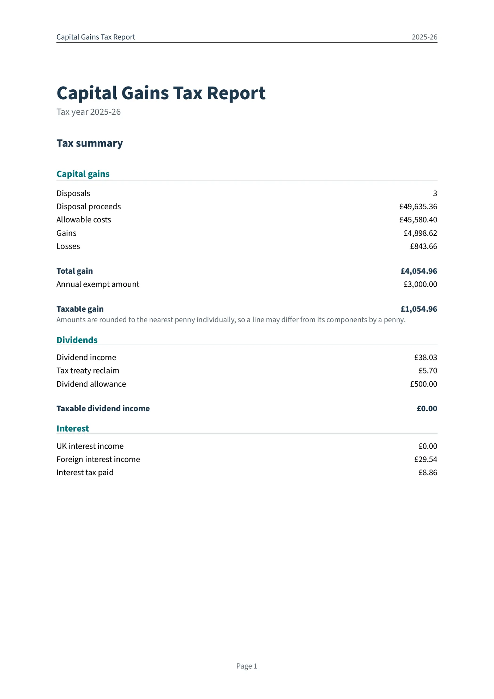
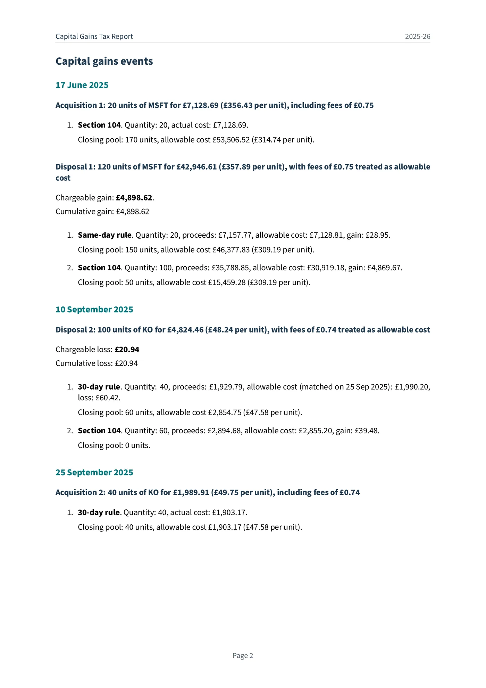
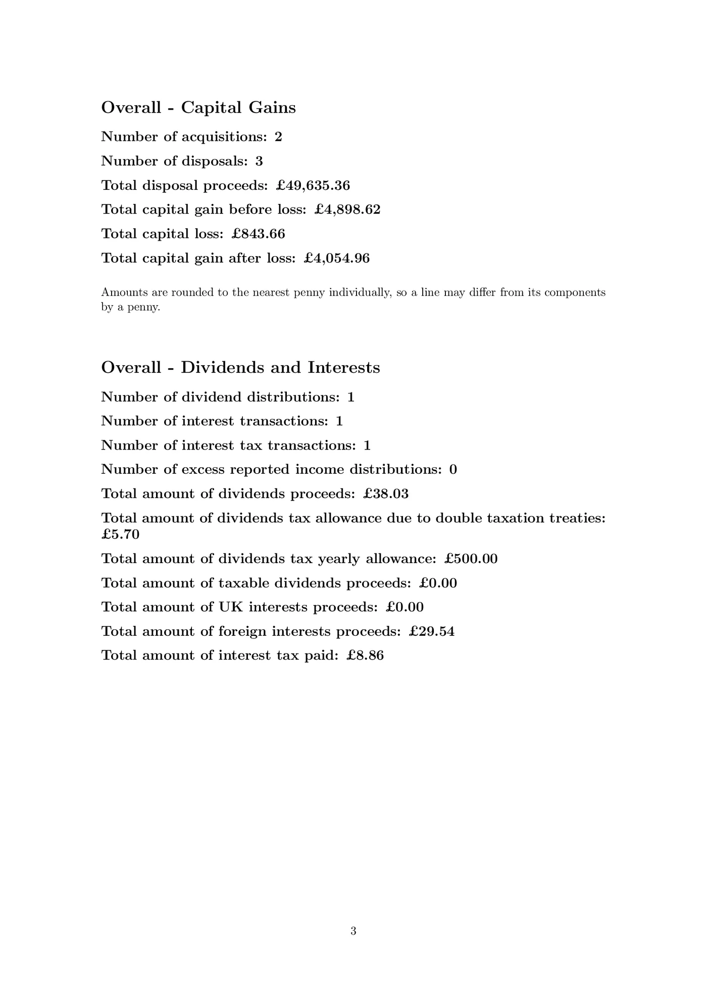

# UK Capital Gains Calculator

Use cgt-calc to calculate **UK capital gains** from your investment transaction history and generate
a detailed report from a supported broker export.

Supported sources include **Charles Schwab**, **Freetrade**, **Hargreaves Lansdown**, **Interactive
Brokers**, **Morgan Stanley**, **Revolut**, **Sharesight**, **Trading 212**, **Vanguard**, or a
custom **RAW** format. Check your broker's guide before starting, especially for employer shares,
because not every award export or transaction type is supported.

## Where to start

- [Installation](installation.md) — install cgt-calc and check that it runs
- [Brokers](brokers/index.md) — find the export instructions for your broker
- [Usage](usage.md) — generate and check your report
- [Offshore funds (ERI)](offshore-funds.md) — if you hold non-UK funds

## What cgt-calc calculates

For supported transactions, the tool converts prices to **GBP** and applies the UK **same-day**,
**30-day ("bed and breakfast")**, and **Section 104 holding** rules. These match a sale with shares
bought or received on the same day, shares bought or received within the following 30 days, then
older shares. It shows **Disposal proceeds** (the sale price or value used when no sale took place),
**Allowable costs** (costs included in the gain or loss calculation), gains, losses, dividends, and
interest in the terminal and writes the full calculation to a **PDF report**.

cgt-calc reports the net gain from the transactions you supply and, for supported tax years,
estimates the amount left after the annual tax-free allowance for capital gains (the **annual exempt
amount**). It does **not** include gains or losses outside those inputs, apply tax rates, work out
your final tax bill, or submit a tax return. Some investment scenarios are not supported; check the
relevant [broker guide](brokers/index.md) and the
[offshore funds limitations](offshore-funds.md#unsupported-functionality) before relying on the
result.

The PDF report opens with a tax summary, followed by separate **Capital gains** and **Dividend and
interest** event sections. Interest is grouped **monthly per broker** to keep reports concise, even
for brokers that pay daily interest. The summary focuses on tax values; the detailed sections number
the underlying events.

## Example report

This compact 2025/26 example shows foreign-currency transactions, how sales are matched with shares
acquired at different times, gains and losses, a dividend with overseas tax, and cash interest:

  
  
  

[View full example report (PDF)](assets/example_report.pdf)
